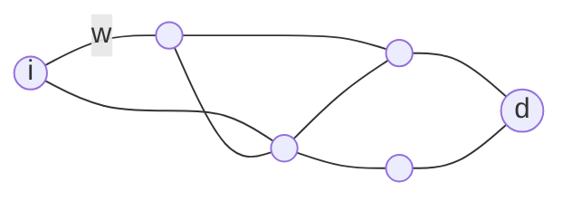

## Standard SOTA Solver

*Implementing the Successive Approximations Algorithm found in the paper [[A tractable class of algorithms for reliable routing in stochastic neworks]], page $3$.*

External material:
https://github.com/mehrdadn/SOTA-Py/blob/master/SOTA.py
*MatLab example* - alternative to Matlab: Octave



Given this formulation of the optimal routing policy for the SOTA problem:

$$
\begin{aligned}
u_i(t) &= \max_{j:(i,j)\in A}\int_0^tp_{ij}(\omega)u_j(t-\omega)d\omega \qquad \forall i\in N, i\neq s, 0\leq t\leq T\\\\
u_s(t) &= 1 \qquad 0\leq t\leq T
\end{aligned}
$$

I would need to implement the SOTA solver

To make the graph stochastic, I will have for the edges:
- mean value
- variance
Then, each time we analyze a link, we will sample from a distribution (Gamma distribution).
Implementation: one adjacency matrix for means and one for variance. 

I will memorize all the values of $u_i(t)$ in a matrix, where the values will be changed at each iteration. We initialize the matrix as:

$$
\begin{aligned}
&u_i(t)=0\quad\forall i\neq d, t\geq0\\
&u_d(t)=1\quad t\geq0
\end{aligned}
$$

>[!note]
>Notations:
>- $u_i(t)$: probability of reaching the destination from a node $i$ within time $t$.

SOTA matrix:

|       | $t=0$    | $t=\Delta t$    | $t=2\Delta t$ | ... |
| ----- | -------- | --------------- | ------------- | --- |
| $i=1$ | $u_1(0)$ | $u_1(\Delta t)$ |               |     |
| $i=2$ | $u_2(0)$ |                 |               |     |
| ...   |          |                 |               |     |
| $i=d$ | 1        | 1               | 1             | 1   |

I need to discretize time: I would discretize it based on the lower edge value in the graph. To do so we can lower-bound the sampled values of the gamma distribution.

>[!note]
>If maximum time budget is $T$, then the number of columns is:
>$$
>N_{col} = \lceil\frac{T}{\Delta t}\rceil+1
>$$
>
>$+1$ because we want to include the column $t=0$.

Population of the SOTA matrix using dynamic programming:
- we analyze the nodes in topological-inverse ordering
- for each node, we analyze all residual times
- for each outgoing arch, we do the convolution of the distribution of times with yet calculated values and we take the maximum value

Graph used as example:
![[Figure_1.png]]

### SOTA solver - documentation

Implementation of the successive approximations algorithm, page $3$ of paper *[[A tractable class of algorithms for reliable routing in stochastic neworks]]*.

```
📁 SOTA solver
   🔹 main.py
   🔹 SOTA.py
   🔹 stochastic_graph.py
```
#### `StochasticGraph`

attributes:
- `adjacency_matrix`
- `variance_matrix`
- `min_edge`: minimum edge in the graph

functions:
- `print_adjacency_matrix()`, `print_variance_matrix()`, `print_graph()`: simple print functions
- `find_min_edge()`: it finds the minimum edge across all the adjacency matrix. We will need this information as we discretize time, using $\Delta t = \text{min\_edge}$ and to lower bound `sample_distance` function.
- `sample_distance(node1, node2)`: it returns the distance between the nodes, sampled using a *Gamma distribution*, retrieving mean and variance from respectively adjacency and variance matrices. The function returns $\infty$ for $0$ values in both adjacency matrix and variance matrix. The return value is lower bounded to *min_edge*.
- `get_min_edge`: we only use the `find_min_edge()` function one time and then retrieve the value from the attributes, as we need it to avoid the complexity going up
- `get_incoming_nodes(node)`: returns a list of nodes that have an edge to the given node, by checking the adjacency matrix.
- `get_successor_nodes(node)`: returns a list of nodes that are reachable from the given node, by checking the adjacency matrix.

#### `SOTA`

attributes:
- `graph`
- `node_s`: start node
- `node_d`: destination node
- `time_budget`
- `num_nodes`
- `min_edge`: shortest time-travelling edge in the whole `StochasticGraph`

functions:
- `initialize_matrix()`: the function initializes the SOTA matrix. We set all entries to $0$, except for the row of *node_d*, that we set to $1$, as we are already on the destination node.
- `compute_density(node_i, node_j, s)`: computes the density function for the edge between nodes $i$ and $j$.
  The density function of a continue distribution $f(s)$ represents the relative probability of a random variable having a value near $s$. Density is defined as:
  $$
  G(s) = \frac{\beta^\alpha s^{\alpha-1}e^{-\beta s}}{\Gamma(\alpha)}
  $$
  Where $\alpha$ and $\beta$ are parameters of the gamma distribution, $\Gamma(\alpha)$ is the gamma function and $s$ is the time past on the arch. $s\approx\omega$, as $\omega$ is the continous time on the arch and $s$ is the discrete time unit corresponding to $w$.
  $$
  \alpha = \frac{(\text{mean})^2}{\text{variance}},\qquad\beta=\frac{\text{mean}}{\text{variance}}
  $$
  We will use the density value in the convolution, as it approssimates $p(s)$ in the convolution formula:
  $$
  \begin{aligned}
  \sum_{s=1}^tp(s)u_j(t-s)\approx\int_0^t p_{ij}(\omega)u_j(t-\omega)d\omega \\
  u_i(t) = \max_j\sum_{s=1}^{t}p(s)\cdot u_j(t-s+1)
  \end{aligned}
  $$
  
  We then return $0$ if $s<\text{min\_edge}$, as the time is less than the minimum physical time between two nodes in the whole graph. In this way we avoid irrealistic probabilities on too small travel-times.
- `printmatrix(matrix, string)`, `print_sota_matrix()`, `print_policy_matrix()`: trivial print functions
- `compute_convolution(node_i, node_j, t)`: computes the discrete convolution for the edge $(i,j)$, using the `compute_density` function and multiplying it to the *sota_matrix* values.
- `extract_path()`: extracts the optimal path from the last column of the policy matrix. From the starting node, reads the entry at the last column, then goes to that index, read the next one and so on, until it gets to destination node.

#### `StandardSOTASolver(SOTA)`

attributes:
- `sota_matrix`: this matrix will contain all the probabilities $u_i(t)$ for each row $i$ and time step $t$.
  Rows correspond to nodes and columns to time steps.
  If maximum time budget is $T$, then the number of columns is:
  $$
  N_{col} = \lceil\frac{T}{\Delta t}\rceil+1
  $$
  "$+1$" because we want to include the column $t=0$.
  SOTA matrix $U$ will be a matrix of dimension $|V| \times (T+1)$.
- `policy_matrix`: matrix that will contain the optimal successor index for each node $i$ and time $t$. It's like a map of the optimal decisions for each state $(i,t)$.

functions:
- `update_node(node_i)`: updates the node of the sota_matrix corresponding to node $i$ for all columns of step $\Delta t$ from $1$ to $T$. Updates also the values of the *policy_matrix* with the best successor for each node and time step.
- `update_sota()`: executing an iteration of the SOTA algorithm on all the nodes. It returns the norm of the difference between the old and the new sota_matrix, as a measure of how much the update changed the matrix.
- `solve(eps, max_iter)`: iteratively updates the sota_matrix until convergence or max iterations reached. The $\text{eps}$ param is the convergence threshold.
- `get_sota_matrix()`, `get_policy_matrix()`

#### `SingleIterationSOTASolver(SOTA)`

functions:
- `compute_convolution(node_i, node_j, t, prev_sota_matrix)`: computes the convolution on *prev_sota_matrix*.
- `update_node(node_i, t, prev_sota_matrix)`: update the maximum probability for node $i$ at time $t$ considering all its successors. We compute the convolution for all the successor nodes and we take the maximum value. We update only the $(i,t)$ entry in the matrix, not the whole row as we did in the StandardSotaSolver.
  The update is based on the previous matrix, as an in-place update would "contaminate" the calculus by reading updated values of another node in the same iteration.
- `update_row(node_i, k, prev_sota_matrix)`: perform an iteration of the single iteration algorithm. Updates the sota_matrix and policy_matrix for time interval: $[\tau_k-\Delta t+1 .. \tau_k]$.
  Note that $\tau_k$ is the maximum temporal instant considered at the iteration $k$. It's the cumulated time that you can spend after $k$ steps of discretization. 
  After the first iteration: $\tau_1=\Delta t$, after two steps: $\tau_2=2\Delta t$. 
  As we start from $k=1$ to $k=L(=\text{number of instants})$, at each iteration $k$ I don't need to re-compute the values from $0$ to $\tau_k-\Delta t$, because I've already updated them in the previous iterations. I only need to update values between $\tau_k-\Delta t+1$ and $t_k$.
  In the code: $\tau_k = \text{tauk}$, $\Delta t = \text{t}$.
- `update_sota(k)`: performs a single iteration of SIA approach. Updates the SOTA matrix for all nodes for the selected time slice $k\in[1..L]$, where $L=T/\Delta t$.
- `solve()`: it solves the SOTA problem using a single iteration approach. Updates the sota_matrix for $L$ iterations.
